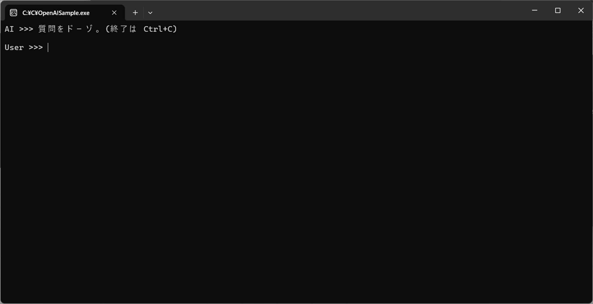
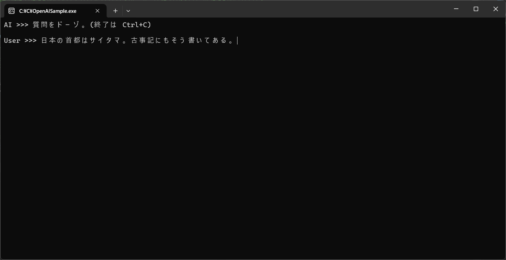
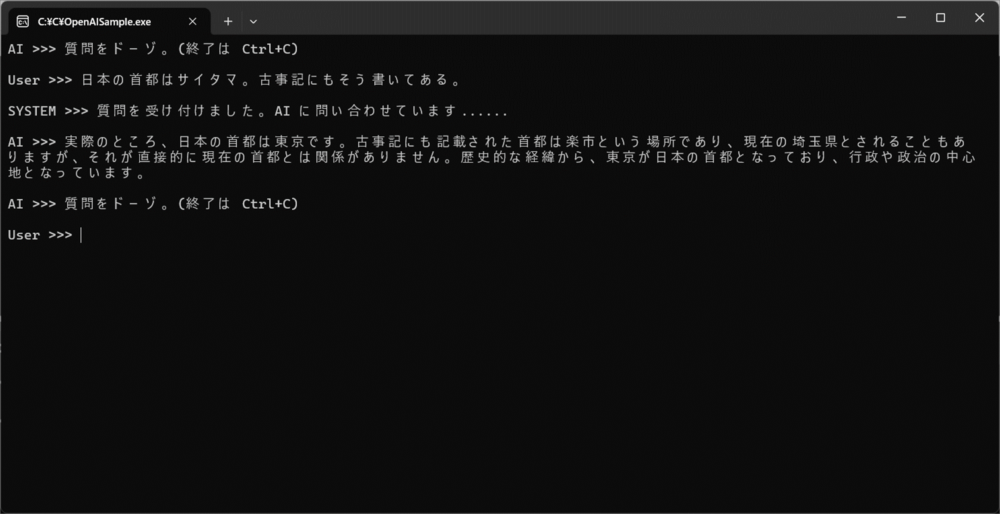
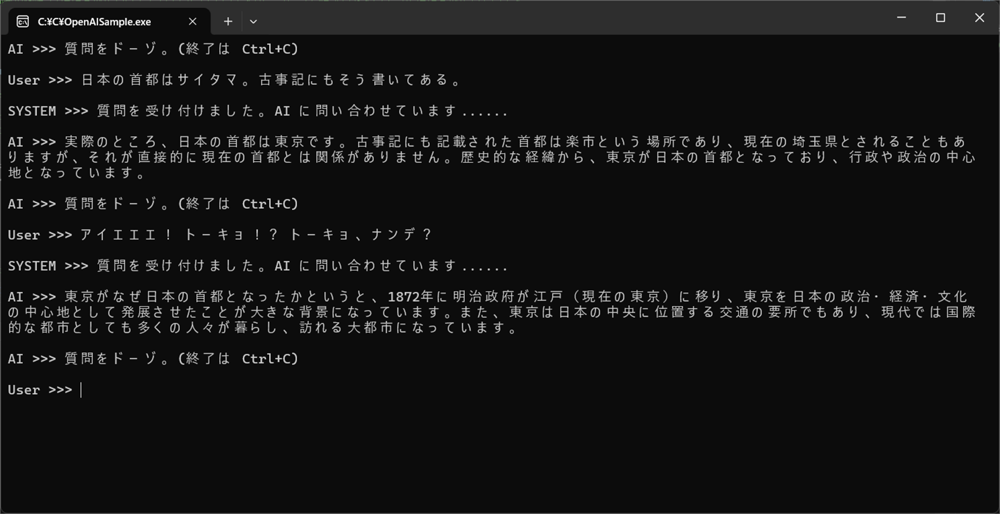

# OpenAIChatSample

Azure OpenAI をコードから使うサンプルです。   

こちらの [Learn の記事](https://learn.microsoft.com/ja-jp/training/modules/open-ai-dotnet-text-completions/4-exercise-install-sdk-create-completion) の内容をベースに理解しやすいコードに再構成しています。  
動作も直感的に、コードも斜めに読んでどうなっているか何をしているかわかりやすくしています。  

NuGet の **Azure.AI.OpenAI** というプレリリースのパッケージを使用してとても簡単に AI チャットを実装しています。

# 動作例
コンソールで対話形式で AI とチャットすることができます。
```
AI >>> 質問をドーゾ。(終了は Ctrl+C)

User >>> 日本の首都はサイタマ。古事記にもそう書いてある。

SYSTEM >>> 質問を受け付けました。AI に問い合わせています......

AI >>> 実際のところ、日本の首都は東京です。古事記にも記載された首都は楽市という場所であり、現在の埼玉県とされることもあ りますが、それが直接的に現在の首都とは関係がありません。歴史的な経緯から、東京が日本の首都となっており、行政や政治の中心地となっています。

AI >>> 質問をドーゾ。(終了は Ctrl+C)

User >>> アイエエエ！ トーキョ！？ トーキョ、ナンデ？

SYSTEM >>> 質問を受け付けました。AI に問い合わせています......

AI >>> 東京がなぜ日本の首都となったかというと、1872年に明治政府が江戸（現在の東京）に移り、東京を日本の政治・経済・文化 の中心地として発展させたことが大きな背景になっています。また、東京は日本の中央に位置する交通の要所でもあり、現代では国際的な都市としても多くの人々が暮らし、訪れる大都市になっています。

AI >>> 質問をドーゾ。(終了は Ctrl+C)

User >>>
```

### 起動直後、ユーザーからの質問を待機

### ユーザーが質問を入力

### AI の回答を表示

### ユーザーが追加の質問を入力、AI がさらに回答

